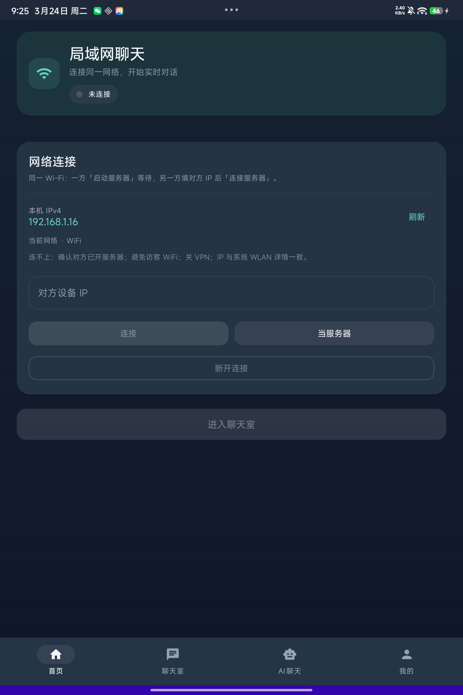
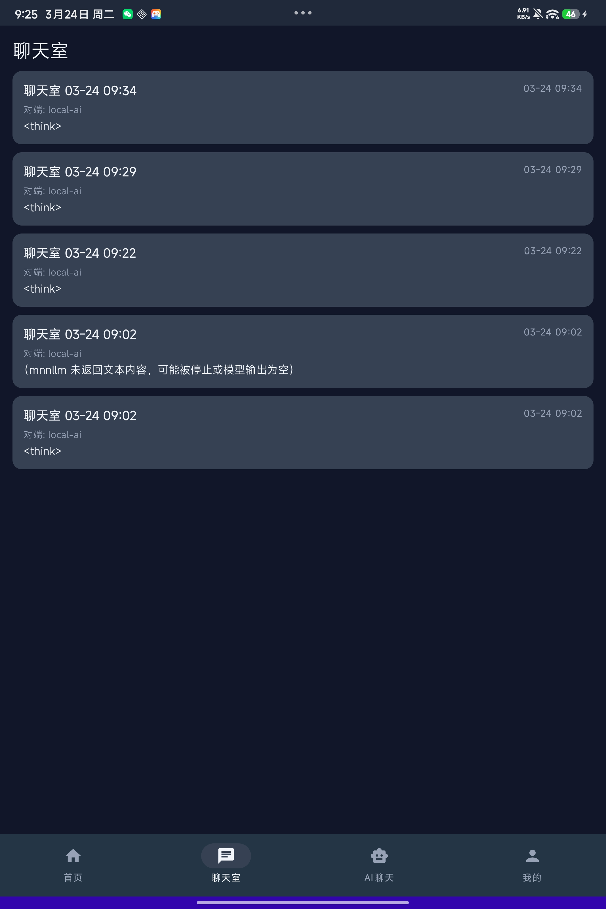
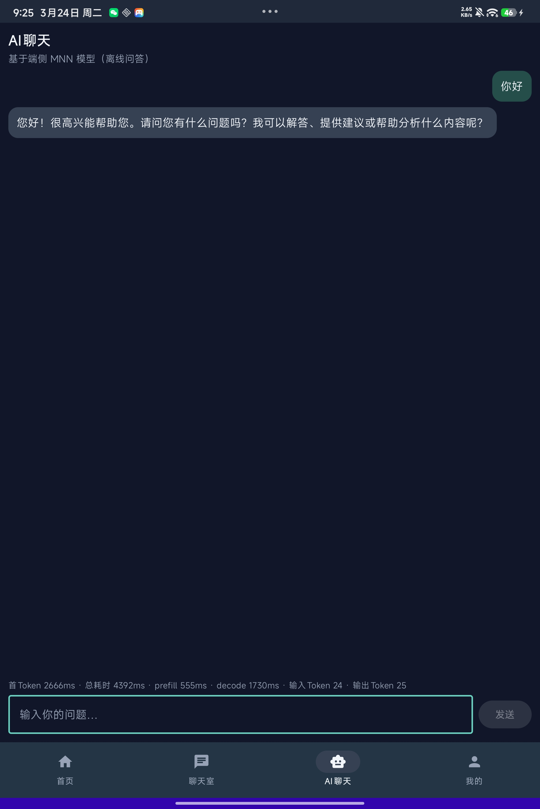
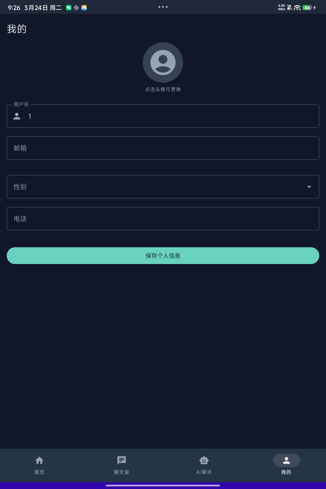

# android-native-IM-ai

安卓原生（Kotlin + Jetpack Compose）局域网 IM 聊天室示例项目。  
当前实现重点是 **同一局域网内两台设备点对点聊天**（Socket 通信），并包含本地消息持久化与连接状态管理。

## 界面展示









## 项目特性

- 局域网通信：一台设备启动服务端，另一台设备通过 IP 连接
- 即时聊天：支持文本消息收发
- 连接状态：连接中、已连接、断开、失败等状态反馈
- 心跳机制：定时心跳包，降低静默断连不可见的问题
- 本地存储：使用 Room 持久化消息记录
- 底部导航：`首页` + `聊天室` + `我的`
- 个人资料：支持编辑头像、邮箱、用户名、性别、电话，并本地缓存
- 聊天室历史：每次进入聊天室都会创建会话，并按会话保存对应消息到本地
- 现代架构：Compose UI + ViewModel + Hilt + Coroutines

## 技术栈

- Kotlin 1.9.22
- Android Gradle Plugin 8.2.0
- Jetpack Compose
- Hilt
- Room
- Gson
- Timber
- SharedPreferences（个人信息本地缓存）

## 运行环境

- Android Studio（建议最新稳定版）
- JDK 17
- Android SDK：
  - `compileSdk = 34`
  - `targetSdk = 34`
  - `minSdk = 24`

## 快速开始

1. 克隆项目并使用 Android Studio 打开根目录
2. 等待 Gradle 同步完成
3. 连接两台安卓设备（或两台模拟器）到同一局域网
4. 分别安装并启动应用
5. 在设备 A：
   - 进入连接页后点击“启动服务器”（监听端口 `8080`）
   - 记录页面展示的本机 IP（局域网 IPv4）
6. 在设备 B：
   - 输入设备 A 的 IP
   - 点击“连接服务器”（App 里默认端口为 `8080`）
7. 连接成功后，双方进入聊天室收发消息
8. 切换到底部 `我的` 页面可编辑并保存个人资料（保存在本地）
9. 切换到底部 `聊天室` 页面可查看历史聊天室并进入查看对应消息

### 手机与 PC AI 对聊（可选）

如果你想让另一端回复 AI（Ollama 或 OpenAI 兼容服务），请在 PC 端启动 `tools/pc-ai-server`。

1. 安装并启动 Ollama（示例）
   - 执行：`ollama serve`
   - 拉模型：`ollama pull llama3.2`（或替换为你自己的模型）
   - 用：`ollama list` 查看准确的模型名（与配置里的 `AIIM_OLLAMA_MODEL` 一致）
2. 配置 `tools/pc-ai-server/.env`
   - 主要控制项：
     - `AIIM_BACKEND`：`ollama` 或 `openai`
     - `AIIM_OLLAMA_URL` / `AIIM_OLLAMA_MODEL`
     - `AIIM_OPENAI_BASE_URL` / `AIIM_OPENAI_MODEL`
     - `AIIM_HOST` / `AIIM_PORT`：监听地址与端口（默认端口 `8080`，与 App 一致）
3. 启动 PC AI 桥接服务
   - 在项目根目录执行：`python .\tools\pc-ai-server\server.py`
   - 该桥接服务与 App 使用同一行协议：Android 一次只维持一条 TCP 连接，适合「手机 <-> PC AI」单会话；如要多会话需要后续扩展。
4. Android 端连接 PC
   - 打开 App 的 `首页`（连接页）
   - 点击“连接服务器”
   - `IP` 填 PC 的局域网 IPv4 地址（端口保持 `8080`）
   - 连接成功后进入聊天室即可开始对话

## 构建命令

在项目根目录执行：

```bash
./gradlew assembleDebug
```

Windows 下：

```powershell
.\gradlew.bat assembleDebug
```

## 目录结构（核心）

```text
app/src/main/java/com/aiim/android
├─ core/        # 基础能力（Socket、工具类、常量）
├─ data/        # 数据层（Room、Repository、Mapper）
├─ domain/      # 领域层（Model、Repository 抽象、UseCase）
├─ di/          # Hilt 依赖注入模块
└─ ui/          # Compose 页面、组件、ViewModel
```

## 使用说明

- 请确保两台设备在同一个局域网（同一个 Wi-Fi）
- 输入 IP 时请使用对端设备在局域网内的 IPv4 地址
- 头像与个人资料数据保存在本机本地缓存，不会自动上传
- 聊天室历史逻辑：从 `首页` 进入聊天室时会自动创建一个会话，并把后续该会话内的消息归档；在 `聊天室` Tab 可点击历史会话查看对应消息。
- 数据库版本升级时当前使用了“破坏性迁移”（`fallbackToDestructiveMigration()`），因此升级大版本可能会清空本地聊天数据。
- 若连接失败，优先检查：
  - 两台设备网络是否互通
  - 对端是否已点击“启动服务器”
  - 网络策略是否限制了局域网通信

## 当前状态与计划

当前已完成：局域网 IM 基础通信与聊天能力。  
并已支持底部导航与本地个人资料管理。  
后续可扩展方向：

- AI 对话接入（本地模型或云端 API）
- 多设备发现（mDNS / 局域网广播）
- 文件/图片消息
- 聊天记录管理（删除、导出、检索）

## 许可证

本项目采用 [MIT License](./LICENSE)。
